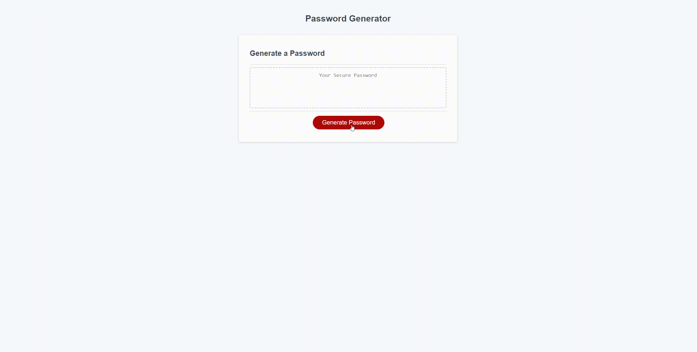

# Password-Generator-HW
Using Javascript i have created code to randomly generate a password on the click of a few buttons. It states the ammount of characters you would like in your password, followed by a series of questions asking for uppercase, lowercase, numbers, and special chartacter. A minimum of one must be chose to generate a password. I completed this by created diffrent variables including a empty variable. The empty variable is then used to take in or deny the characters when asked if you want those characters or not.

link: https://b-locatelli.github.io/Password-Generator-HW/

